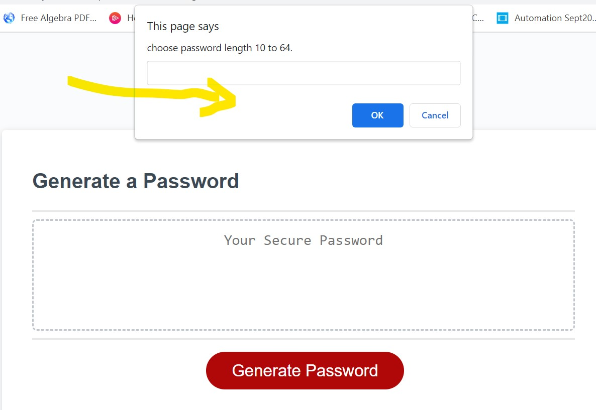

# PassWord Generator
## Project Description
This project is about an automatic password generator that auto generates passwords within the length of 10 and 64 for users based on certain user input option.

## How it Works
In other to auto generate a password, the website prompt user with various password options to choose for the password combination needed.
### Options Prompted
 * Password Length. 
 * Lowercase characters.
 * Uppercase characters.
 * Numeric values.
 * Special characters.
 
 If no password length options is selected (by clicking cancel or ok without a valid input), there is an alert to indicated this and need to start the password generation process again.

 If a valid password length is entered, then other password options is displayed to choose.
 At least one password must be selected if not the process cancelled and need to start password generation again. 

 If all combination is valid then the password is generated and printed on screen.

 ## How to run project on local machine
* Install Visual Studio Code
* Navigate to main page of the git Repository
* Click on the 'Code'
* Copy the SSH line to run on the Terminal or  the HTTPS link
* Clone the repository - 

## links
#### Deployed Url: [Password Generator](https://yemioyedeji89.github.io/PassWordGenerator/).

## Web Page Screenshots

 

## Contribute
If you want to learn more about git clone. you can seek inspiration from the below:
#### External files
[Github Docs](https://docs.github.com/en/repositories)
